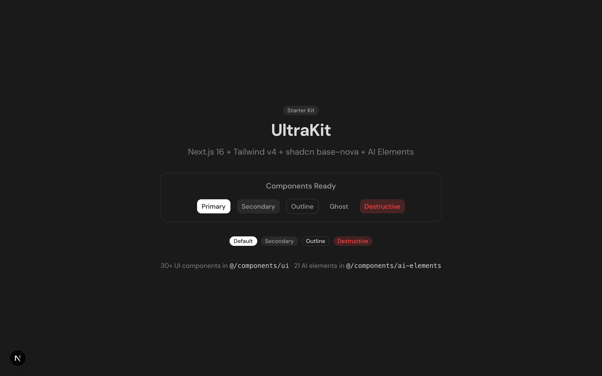

# UltraKit

An opinionated Next.js 16 starter with shadcn base-nova components and Vercel AI SDK UI elements. Built around my personal taste — skip the boilerplate, start building.



## What's Inside

**30+ UI Components** from [shadcn/ui](https://ui.shadcn.com) (base-nova style) — Accordion, Alert Dialog, Button, Card, Checkbox, Combobox, Command Palette, Context Menu, Dialog, Dropdown Menu, Hover Card, Input, Label, Popover, Progress, Scroll Area, Select, Separator, Skeleton, Tabs, Textarea, Tooltip, and more.

**21 AI Elements** from the [Vercel AI SDK registry](https://sdk.vercel.ai) — Conversation, Message, Prompt Input, Code Block, Reasoning, Chain of Thought, Artifact, Confirmation, Suggestion, Task, Tool, Sources, and more. Everything you need to build AI-powered chat interfaces.

## Stack

- **Next.js 16** with Turbopack
- **React 19**
- **Tailwind CSS v4** with `@tailwindcss/typography`
- **shadcn/ui** (base-nova style) with Phosphor Icons
- **Vercel AI SDK** (`ai` + `@ai-sdk/react`)
- **Motion** (Framer Motion) for animations
- **Shiki** for syntax highlighting
- **DM Sans** font

## Getting Started

```bash
# Clone
git clone https://github.com/imprakharshukla/ultrakit.git
cd ultrakit

# Install
bun install

# Dev
bun dev
```

Open [http://localhost:3000](http://localhost:3000).

## Project Structure

```
src/
  app/
    layout.tsx          # Root layout (dark mode, DM Sans)
    page.tsx            # Demo page
  components/
    ui/                 # 30+ shadcn base-nova components
    ai-elements/        # 21 Vercel AI SDK components
  lib/
    utils.ts            # cn() helper
  styles.css            # Tailwind v4 + theme variables
components.json         # shadcn config (add more with `bunx shadcn add`)
```

## Adding More Components

```bash
# Add any shadcn component
bunx shadcn@latest add [component-name]

# Add AI elements
bunx shadcn@latest add https://registry.ai-sdk.dev/[element-name].json
```

## Theming

This is a dark-only starter. Both the "light" and "dark" themes are dark — that's intentional and a personal preference. Theme variables are defined in `src/styles.css`. The dark theme uses a minimal, high-contrast palette with white primary on dark backgrounds. You're free to swap in a proper light theme if that's your thing.

## License

MIT
